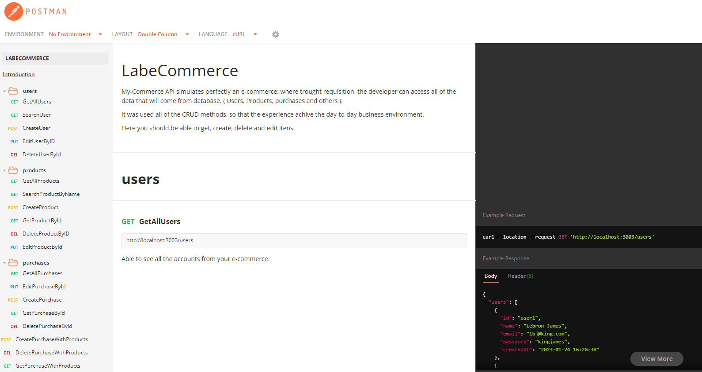

# MyCommerce Back-End 

This project simulate perfectly an E-Commerce Back-End Application, Where trought a Restful API the developer can access and configure the data that it's coming from DataBase.( Users, Products and Purchases ). The methods chosen for this API were the CRUD one's so the user can create, read, uptade and delete information; all of them based on a day-to-day business environment.

- TypeScript
- Node.Js
- Package.JSON
- Express
- Cors
- Require and Response
- Back-End Data Flow
- Back-End Data Validation
- API creation
- Postmann
- Knex
- Git/GitHub

## Access to the API
[LabeCommerce Back-End](https://documenter.getpostman.com/view/24461072/2s8ZDR7RG2)

## 📄 Description
1. LabeCommerce API Documentation
    - Index.ts page it's resposible for all the requisitions, there you access the API creation code. What you can or can't do with the requisitions(Data validation).
    - Types.ts page it's resposible for all the types used on the application; there you can have access to all objects used on the application.
    - Package.JSON page it's resposible for the scripts created trought Node.Js.
    - Database folder contains 3 different types of archives and it's resposible for all the data mocked on the application.
    - Knex.ts page it's responsible for the knex configuration.
    - mycommerce.db contains all the database and it's connected to SQLite database.
    - mycommerce.sql contains all the SQL syntax code; there you can have access to the mocked data and the requisitions used on the App.
    - API created and consumed using POSTMANN platform.

    ## ⚒️ Technologies

